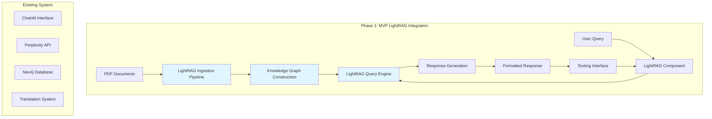
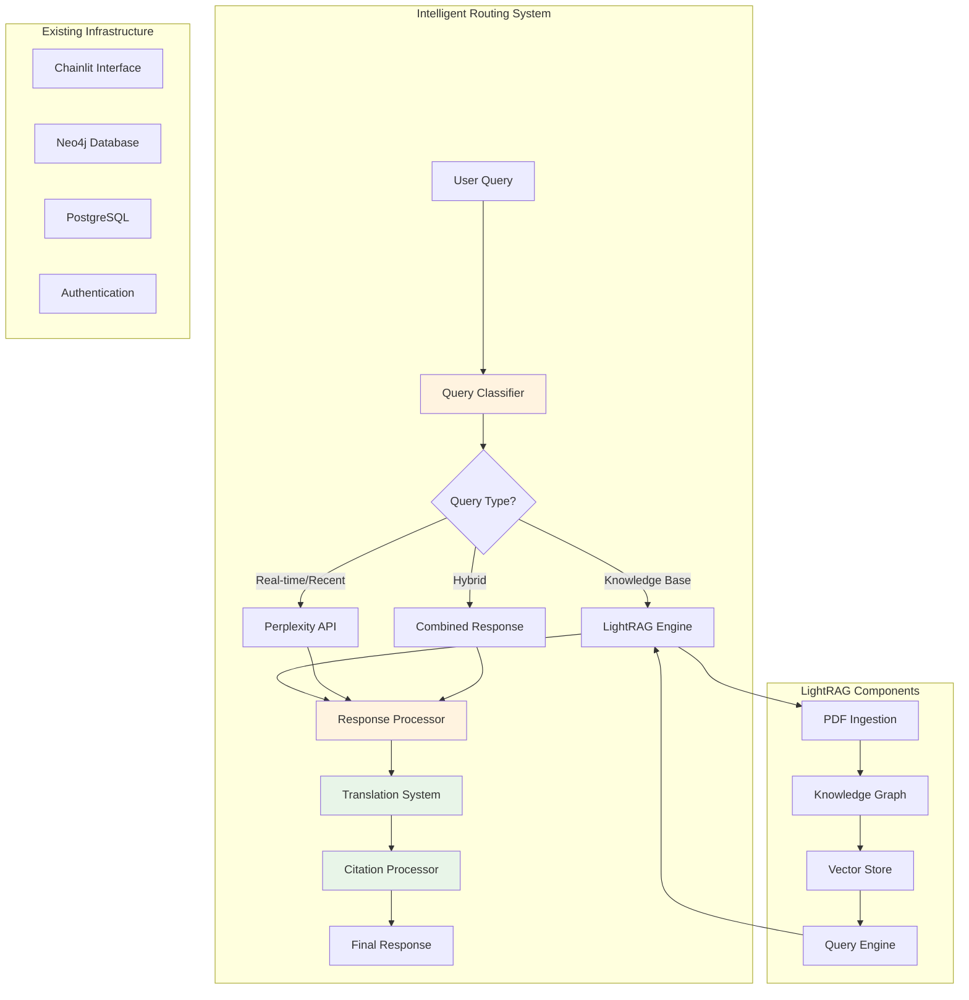

# Design Document

## Overview

This document outlines the design for integrating LightRAG (Light Retrieval-Augmented Generation) into the Clinical Metabolomics Oracle system. The integration follows a two-phase approach: an MVP for standalone testing and validation, followed by a comprehensive long-term solution with intelligent routing capabilities.

The current system uses Chainlit for the web interface, Perplexity API for real-time information retrieval, Neo4j for knowledge graph storage, and includes sophisticated multi-language translation and citation processing. LightRAG will enhance this by providing local knowledge graph-based retrieval for ingested research papers, creating a hybrid system that combines local expertise with real-time web search capabilities.

## Architecture

### Current System Architecture

The existing Clinical Metabolomics Oracle consists of:

- **Frontend**: Chainlit-based web interface with authentication and multi-language support
- **Backend**: FastAPI application with async processing capabilities
- **Knowledge Storage**: Neo4j graph database for structured biomedical knowledge
- **External APIs**: Perplexity API for real-time web search and information retrieval
- **Translation System**: Multi-language support using Google Translate and OPUS-MT
- **Citation Processing**: Sophisticated citation formatting and bibliography generation
- **Database**: PostgreSQL with Prisma ORM for conversation and user data storage

### Phase 1: MVP Architecture



### Phase 2: Long-term Architecture



## Components and Interfaces

### 1. LightRAG Core Component

**Purpose**: Encapsulates all LightRAG functionality in a modular, importable component.

**Interface**:
```python
class LightRAGComponent:
    def __init__(self, config: LightRAGConfig):
        """Initialize LightRAG with configuration"""
        
    async def ingest_documents(self, pdf_paths: List[str]) -> IngestResult:
        """Ingest PDF documents into knowledge graph"""
        
    async def query(self, question: str, context: Optional[Dict] = None) -> LightRAGResponse:
        """Query the knowledge graph and return response"""
        
    async def get_health_status(self) -> HealthStatus:
        """Return system health and statistics"""
        
    def get_supported_formats(self) -> List[str]:
        """Return supported document formats"""
```

**Key Features**:
- Async/await support for non-blocking operations
- Comprehensive error handling with detailed logging
- Configuration-driven behavior
- Health monitoring and metrics collection
- Extensible document format support

### 2. PDF Ingestion Pipeline

**Purpose**: Process PDF documents from the `papers/` directory and extract structured information.

**Components**:
- **PDF Parser**: Extract text content using PyMuPDF or similar
- **Text Preprocessor**: Clean and normalize extracted text
- **Entity Extractor**: Identify biomedical entities using NER models
- **Relationship Extractor**: Detect relationships between entities
- **Knowledge Graph Builder**: Construct graph representation

**Interface**:
```python
class PDFIngestionPipeline:
    async def process_directory(self, directory_path: str) -> List[ProcessResult]:
        """Process all PDFs in directory"""
        
    async def process_file(self, pdf_path: str) -> ProcessResult:
        """Process single PDF file"""
        
    async def extract_entities(self, text: str) -> List[Entity]:
        """Extract biomedical entities from text"""
        
    async def extract_relationships(self, text: str, entities: List[Entity]) -> List[Relationship]:
        """Extract relationships between entities"""
```

### 3. Intelligent Query Router

**Purpose**: Analyze incoming queries and route them to the most appropriate response system.

**Routing Logic**:
- **LightRAG**: Queries about established knowledge, definitions, mechanisms
- **Perplexity API**: Recent research, current events, real-time information
- **Hybrid**: Complex queries requiring both local knowledge and recent information

**Interface**:
```python
class QueryRouter:
    def __init__(self, llm_classifier: BaseLLM, config: RouterConfig):
        """Initialize with LLM for classification"""
        
    async def classify_query(self, query: str, context: Optional[Dict] = None) -> QueryClassification:
        """Classify query and determine routing strategy"""
        
    async def route_query(self, query: str, classification: QueryClassification) -> RoutedResponse:
        """Route query to appropriate system(s)"""
        
    def get_routing_metrics(self) -> Dict[str, Any]:
        """Return routing statistics and performance metrics"""
```

### 4. Response Integration System

**Purpose**: Combine responses from different sources and ensure compatibility with existing features.

**Interface**:
```python
class ResponseIntegrator:
    async def process_lightrag_response(self, response: LightRAGResponse) -> ProcessedResponse:
        """Process LightRAG response for integration"""
        
    async def combine_responses(self, lightrag_resp: ProcessedResponse, 
                              perplexity_resp: ProcessedResponse) -> CombinedResponse:
        """Combine multiple responses intelligently"""
        
    async def apply_translation(self, response: ProcessedResponse, 
                              target_language: str) -> TranslatedResponse:
        """Apply translation to response content"""
        
    async def generate_citations(self, response: ProcessedResponse) -> CitedResponse:
        """Generate proper citations for response sources"""
```

## Data Models

### LightRAG Configuration

```python
@dataclass
class LightRAGConfig:
    # Storage configuration
    knowledge_graph_path: str
    vector_store_path: str
    cache_directory: str
    
    # Processing configuration
    chunk_size: int = 1000
    chunk_overlap: int = 200
    max_entities_per_chunk: int = 50
    
    # Model configuration
    embedding_model: str = "intfloat/e5-base-v2"
    llm_model: str = "groq:Llama-3.3-70b-Versatile"
    
    # Performance configuration
    batch_size: int = 32
    max_concurrent_requests: int = 10
    cache_ttl_seconds: int = 3600
```

### Document Processing Models

```python
@dataclass
class ProcessedDocument:
    document_id: str
    file_path: str
    title: str
    authors: List[str]
    abstract: str
    content_chunks: List[TextChunk]
    entities: List[Entity]
    relationships: List[Relationship]
    metadata: Dict[str, Any]
    processing_timestamp: datetime

@dataclass
class Entity:
    entity_id: str
    text: str
    entity_type: str  # e.g., "metabolite", "disease", "pathway"
    confidence_score: float
    source_document: str
    context: str

@dataclass
class Relationship:
    relationship_id: str
    source_entity: str
    target_entity: str
    relationship_type: str
    confidence_score: float
    evidence_text: str
    source_document: str
```

### Query and Response Models

```python
@dataclass
class QueryClassification:
    query_type: str  # "knowledge_base", "real_time", "hybrid"
    confidence_score: float
    reasoning: str
    suggested_sources: List[str]

@dataclass
class LightRAGResponse:
    answer: str
    confidence_score: float
    source_documents: List[str]
    entities_used: List[Entity]
    relationships_used: List[Relationship]
    processing_time: float
    metadata: Dict[str, Any]

@dataclass
class CitedResponse:
    content: str
    citations: List[Citation]
    bibliography: str
    confidence_scores: Dict[str, float]
```

## Error Handling

### Error Categories and Strategies

1. **PDF Processing Errors**
   - Corrupted files: Skip and log, continue processing
   - Extraction failures: Retry with alternative parsers
   - Memory issues: Process in smaller batches

2. **Knowledge Graph Construction Errors**
   - Entity extraction failures: Use fallback NER models
   - Relationship extraction issues: Continue with available data
   - Graph storage errors: Implement transaction rollback

3. **Query Processing Errors**
   - LightRAG failures: Fall back to Perplexity API
   - Perplexity API failures: Use cached responses or LightRAG
   - Classification errors: Default to hybrid approach

4. **Integration Errors**
   - Translation failures: Return response in original language
   - Citation processing errors: Provide simplified citations
   - Response combination issues: Return best available response

### Error Handling Implementation

```python
class ErrorHandler:
    def __init__(self, config: ErrorHandlingConfig):
        self.retry_config = config.retry_config
        self.fallback_config = config.fallback_config
        self.logger = logging.getLogger(__name__)
    
    async def handle_pdf_error(self, error: Exception, pdf_path: str) -> Optional[ProcessResult]:
        """Handle PDF processing errors with retries and fallbacks"""
        
    async def handle_query_error(self, error: Exception, query: str) -> FallbackResponse:
        """Handle query processing errors with graceful degradation"""
        
    def log_error(self, error: Exception, context: Dict[str, Any]) -> None:
        """Log errors with structured context for debugging"""
```

## Testing Strategy

### Unit Testing

1. **Component Testing**
   - LightRAG component initialization and configuration
   - PDF ingestion pipeline individual stages
   - Query router classification accuracy
   - Response integration functionality

2. **Integration Testing**
   - End-to-end document processing workflow
   - Query routing and response generation
   - Translation and citation integration
   - Error handling and fallback mechanisms

3. **Performance Testing**
   - Document ingestion throughput
   - Query response times
   - Concurrent user handling
   - Memory usage optimization

### Test Data and Scenarios

1. **MVP Validation Tests**
   - Test corpus of clinical metabolomics papers
   - Predefined question set including "What is clinical metabolomics?"
   - Accuracy benchmarks for answer quality
   - Performance benchmarks for response times

2. **Integration Tests**
   - Multi-language query processing
   - Citation format consistency
   - Confidence score accuracy
   - Fallback mechanism reliability

3. **Load Testing**
   - 50+ concurrent users
   - Large document collections (1000+ papers)
   - Extended operation periods
   - Resource utilization monitoring

### Success Metrics

1. **Accuracy Metrics**
   - Answer accuracy: ≥85% for clinical metabolomics questions
   - Citation accuracy: ≥95% for source attribution
   - Entity extraction precision: ≥80%
   - Relationship extraction recall: ≥70%

2. **Performance Metrics**
   - Query response time: <5 seconds for 95% of requests
   - Document ingestion rate: ≥10 papers per minute
   - System availability: ≥99.5% uptime
   - Memory usage: <8GB for 1000 document collection

3. **User Experience Metrics**
   - Translation accuracy: ≥90% semantic preservation
   - Citation format consistency: 100%
   - Error recovery success rate: ≥95%
   - User satisfaction score: ≥4.0/5.0

## Implementation Phases

### Phase 1: MVP Implementation (4-6 weeks)

**Week 1-2: Core LightRAG Component**
- Set up LightRAG library and dependencies
- Implement basic PDF ingestion pipeline
- Create knowledge graph construction logic
- Develop query processing interface

**Week 3-4: Integration and Testing**
- Integrate with existing Chainlit interface
- Implement basic error handling
- Create test suite for MVP functionality
- Validate "What is clinical metabolomics?" test case

**Week 5-6: Optimization and Documentation**
- Performance optimization and caching
- Comprehensive testing and bug fixes
- Documentation and deployment preparation
- User acceptance testing

### Phase 2: Long-term Solution (8-12 weeks)

**Week 1-3: Intelligent Routing System**
- Implement LLM-based query classifier
- Develop routing logic and decision engine
- Create response integration framework
- Test routing accuracy and performance

**Week 4-6: Feature Integration**
- Integrate with translation system
- Implement citation processing for LightRAG responses
- Add confidence scoring mechanisms
- Ensure UI consistency across response types

**Week 7-9: Scalability and Robustness**
- Implement caching and optimization strategies
- Add comprehensive error handling and fallbacks
- Create monitoring and alerting systems
- Performance testing and optimization

**Week 10-12: Maintenance and Deployment**
- Implement update and maintenance procedures
- Create administrative interfaces
- Final testing and quality assurance
- Production deployment and monitoring setup

## Security and Privacy Considerations

1. **Data Security**
   - Encrypt stored knowledge graphs and vector embeddings
   - Secure API key management for external services
   - Implement access controls for administrative functions

2. **Privacy Protection**
   - Anonymize user queries in logs
   - Implement data retention policies
   - Ensure GDPR compliance for user data

3. **System Security**
   - Input validation and sanitization
   - Rate limiting and abuse prevention
   - Regular security audits and updates

## Monitoring and Maintenance

1. **System Monitoring**
   - Query response times and success rates
   - Document processing throughput
   - Error rates and types
   - Resource utilization (CPU, memory, storage)

2. **Content Management**
   - Automated monitoring for new research papers
   - Version control for knowledge base updates
   - Quality assurance for ingested content
   - Deprecation handling for outdated information

3. **Performance Optimization**
   - Query pattern analysis and optimization
   - Caching strategy refinement
   - Index optimization for faster retrieval
   - Resource scaling based on usage patterns