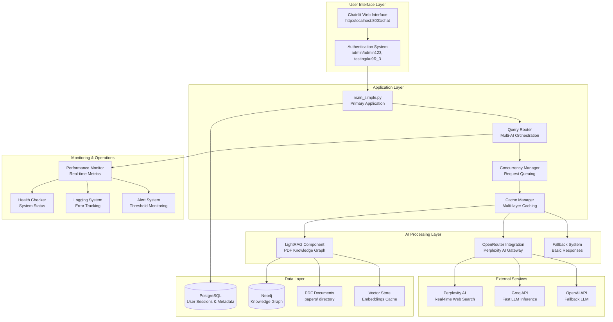

# Clinical Metabolomics Oracle - System Architecture

## Overview

The Clinical Metabolomics Oracle (CMO) is a sophisticated AI-powered chatbot system designed for clinical metabolomics research. It employs a multi-AI backend architecture with intelligent fallback mechanisms to ensure high availability and research-grade response quality.

## Architecture Diagram



## Component Details

### 1. User Interface Layer

#### Chainlit Web Interface
- **Technology**: Chainlit v1.4.0+
- **URL**: http://localhost:8001/chat
- **Features**: Real-time chat, file upload, message history
- **Authentication**: Simple credential-based system

#### Authentication System
- **Type**: Password-based authentication
- **Credentials**: 
  - `admin/admin123` (administrator access)
  - `testing/ku9R_3` (testing access)
- **Session Management**: Chainlit user sessions

### 2. Application Layer

#### Primary Application (main_simple.py)
- **Framework**: Chainlit + FastAPI
- **Responsibilities**:
  - Request handling and routing
  - User session management
  - Response formatting and delivery
  - Error handling coordination

#### Query Router
- **Function**: Multi-AI backend orchestration
- **Logic**: LightRAG → OpenRouter/Perplexity → Fallback
- **Features**: Intelligent routing based on query type and system availability

#### Concurrency Manager
- **Capacity**: Up to 10 concurrent users
- **Features**: Request queuing, priority handling, rate limiting
- **Implementation**: Async/await with request pools

#### Cache Manager
- **Layers**: Memory cache, disk cache, database cache
- **TTL**: Configurable (default 1 hour)
- **Strategy**: LRU eviction with intelligent prefetching

### 3. AI Processing Layer

#### LightRAG Component
- **Purpose**: PDF knowledge graph processing
- **Technology**: LightRAG-HKU v0.0.0.7.post1
- **Features**:
  - PDF text extraction and processing
  - Knowledge graph construction (Neo4j)
  - Semantic search with vector embeddings
  - Entity and relationship extraction

#### OpenRouter Integration
- **Purpose**: Access to Perplexity AI models
- **Models Available**:
  - `perplexity/sonar-pro` (default, professional-grade)
  - `perplexity/llama-3.1-sonar-small-128k-online`
  - `perplexity/llama-3.1-sonar-large-128k-online`
  - `perplexity/llama-3.1-sonar-huge-128k-online`
- **Features**: Real-time web search, citation extraction, confidence scoring

#### Fallback System
- **Purpose**: Ensure 100% availability
- **Implementation**: Basic metabolomics knowledge responses
- **Triggers**: When primary and secondary AI systems fail

### 4. Data Layer

#### PostgreSQL Database
- **Purpose**: User sessions, conversation history, metadata
- **ORM**: Prisma with async support
- **Schema**: Defined in `prisma/schema.prisma`
- **Tables**: Users, Threads, Steps, Elements, Feedback

#### Neo4j Graph Database
- **Purpose**: Knowledge graph storage for LightRAG
- **Features**: Entity relationships, semantic connections
- **Queries**: Cypher-based graph traversal
- **Optional**: System works without Neo4j (degraded mode)

#### PDF Document Storage
- **Location**: `papers/` directory
- **Processing**: Automatic ingestion on startup
- **Formats**: PDF files with text extraction
- **Monitoring**: Directory watching for new files

#### Vector Store
- **Purpose**: Embedding storage for semantic search
- **Model**: intfloat/e5-base-v2 (default)
- **Storage**: Local file system (`data/lightrag_vectors/`)
- **Features**: Similarity search, batch processing

### 5. External Services

#### Perplexity AI
- **Access**: Via OpenRouter API
- **Features**: Real-time web search, professional-grade responses
- **Context**: 127K tokens
- **Cost**: ~$0.001-0.005 per query

#### Groq API
- **Model**: Llama-3.3-70b-Versatile
- **Purpose**: Fast LLM inference
- **Features**: High-speed processing, cost-effective

#### OpenAI API
- **Purpose**: Fallback LLM provider
- **Usage**: When other services unavailable
- **Models**: GPT-3.5/GPT-4 (configurable)

### 6. Monitoring & Operations

#### Performance Monitor
- **Metrics**: Response times, throughput, error rates
- **Storage**: Time-series data with configurable retention
- **Alerts**: Threshold-based alerting system
- **Dashboard**: Real-time metrics via `/metrics` endpoint

#### Health Checker
- **Endpoint**: `/health` and `/health/detailed`
- **Components**: All system components monitored
- **Status**: HEALTHY, DEGRADED, UNHEALTHY
- **Frequency**: Continuous monitoring with caching

#### Logging System
- **Levels**: DEBUG, INFO, WARNING, ERROR, CRITICAL
- **Destinations**: Console, file, structured logging
- **Rotation**: Automatic log rotation and archival
- **Location**: `src/lightrag_integration/logs/`

#### Alert System
- **Triggers**: Performance thresholds, error rates, system health
- **Notifications**: Log-based alerts (extensible to email/Slack)
- **Configuration**: `src/lightrag_integration/deployment/alert_rules.yml`

## Data Flow

### Query Processing Flow

1. **User Input**: Question submitted via Chainlit interface
2. **Authentication**: User credentials validated
3. **Request Queuing**: Concurrency manager handles request
4. **Cache Check**: System checks for cached responses
5. **Primary Processing**: LightRAG searches PDF knowledge base
6. **Secondary Processing**: If needed, OpenRouter/Perplexity query
7. **Fallback Processing**: Basic response if AI systems fail
8. **Response Formatting**: Citations, confidence scores, metadata added
9. **Delivery**: Response sent to user via Chainlit
10. **Logging**: Request/response logged for monitoring

### Document Ingestion Flow

1. **File Detection**: PDF files placed in `papers/` directory
2. **Text Extraction**: PDF content extracted using PyPDF2
3. **Preprocessing**: Text cleaning and chunking
4. **Embedding Generation**: Vector embeddings created
5. **Graph Construction**: Entities and relationships extracted
6. **Storage**: Data stored in Neo4j and vector store
7. **Indexing**: Search indices updated
8. **Monitoring**: Progress tracked and logged

## Performance Characteristics

### Response Times
- **LightRAG Queries**: 0.5-2.0 seconds
- **OpenRouter/Perplexity**: 1.0-3.0 seconds
- **Fallback Responses**: <0.1 seconds
- **Overall System**: 0.5-3.0 seconds (95th percentile)

### Throughput
- **Concurrent Users**: Up to 10 simultaneous
- **Queries per Minute**: ~100-200 (depending on complexity)
- **PDF Processing**: 1-2 documents per minute
- **Cache Hit Rate**: 60-80% (typical)

### Resource Usage
- **Memory**: 500MB-2GB (depending on knowledge base size)
- **CPU**: 10-50% (during active processing)
- **Disk**: 100MB-10GB (knowledge base and cache)
- **Network**: Minimal (external API calls only)

## Security Considerations

### Authentication & Authorization
- **Method**: Simple password-based authentication
- **Session Management**: Chainlit built-in session handling
- **Access Control**: Role-based access (admin vs. testing)

### Data Protection
- **API Keys**: Stored in environment variables
- **Database**: Local PostgreSQL with standard security
- **File System**: Local file permissions
- **Network**: HTTPS recommended for production

### External API Security
- **OpenRouter**: API key authentication
- **Rate Limiting**: Built-in request throttling
- **Error Handling**: No sensitive data in error messages

## Deployment Options

### Development Deployment
```bash
# Simple startup for development
python start_chatbot_uvicorn.py
```

### Production Deployment
```bash
# Production-ready with Gunicorn
python start_chatbot_gunicorn.py
```

### Docker Deployment
```bash
# Using provided Docker configuration
docker-compose up -d
```

### Configuration Management
- **Environment Variables**: `.env` file configuration
- **Database Migrations**: Prisma-based schema management
- **Monitoring Setup**: Automated monitoring configuration

## Scalability Considerations

### Horizontal Scaling
- **Load Balancing**: Multiple application instances
- **Database Scaling**: PostgreSQL read replicas
- **Cache Distribution**: Redis cluster for shared caching

### Vertical Scaling
- **Memory**: Increase for larger knowledge bases
- **CPU**: More cores for concurrent processing
- **Storage**: SSD for better I/O performance

### Performance Optimization
- **Caching Strategy**: Multi-layer caching implementation
- **Connection Pooling**: Database connection optimization
- **Async Processing**: Non-blocking I/O throughout

## Monitoring & Observability

### Key Metrics
- **Response Time**: Query processing latency
- **Throughput**: Queries per second/minute
- **Error Rate**: Failed requests percentage
- **System Health**: Component availability
- **Resource Usage**: CPU, memory, disk utilization

### Alerting Thresholds
- **Response Time**: >5s warning, >10s critical
- **Error Rate**: >5% warning, >10% critical
- **Memory Usage**: >85% warning, >95% critical
- **Disk Usage**: >80% warning, >90% critical

### Log Analysis
- **Structured Logging**: JSON-formatted logs
- **Error Tracking**: Automatic error categorization
- **Performance Tracking**: Request/response timing
- **User Analytics**: Usage patterns and trends

## Future Enhancements

### Planned Features
- **Multi-PDF Support**: Enhanced document corpus management
- **Advanced Search**: Semantic search improvements
- **User Interface**: Enhanced web interface with more features
- **API Integration**: RESTful API for external integrations

### Scalability Improvements
- **Microservices**: Component separation for better scaling
- **Message Queues**: Async processing with Redis/RabbitMQ
- **Distributed Caching**: Redis cluster implementation
- **Container Orchestration**: Kubernetes deployment

### AI Enhancements
- **Model Fine-tuning**: Domain-specific model training
- **Multi-modal Support**: Image and table processing
- **Advanced Citations**: Enhanced source verification
- **Confidence Calibration**: Improved confidence scoring

---

*This architecture document reflects the current implementation as of January 2025. For the most up-to-date information, refer to the source code and configuration files.*